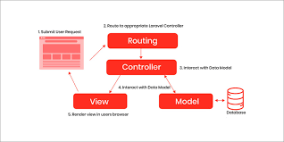
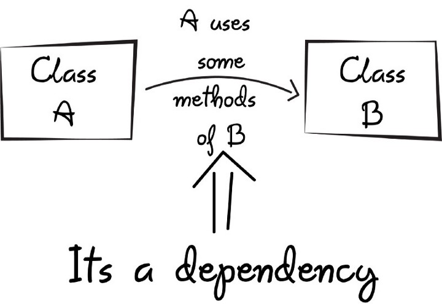

# Восьмой урок урок по PHP
## Каркас приложения

## шаблонизатор Twig 

### Twig Documentation 
[Twig for Template Designers](https://twig.symfony.com/doc/3.x/templates.html)

[Twig for Developers](https://twig.symfony.com/doc/3.x/api.html)

[Руководство по Твиг на русском языке ](https://dev-gang.ru/doc/twig/for_template_designers/)

[Что такое шаблонизатор Twig и зачем он нужен? ](https://racurs.agency/blog/programming/chto-takoye-shablonizator-twig-i-zachem-on-nuzhen/)

## Внедрение зависимости

[Wiki](https://ru.wikipedia.org/wiki/%D0%92%D0%BD%D0%B5%D0%B4%D1%80%D0%B5%D0%BD%D0%B8%D0%B5_%D0%B7%D0%B0%D0%B2%D0%B8%D1%81%D0%B8%D0%BC%D0%BE%D1%81%D1%82%D0%B8)

[PHP-DI](https://php-di.org/)

## Composer

[Как пользоваться Composer](https://losst.pro/kak-polzovatsya-composer)

[Composer для самых маленьких](https://habr.com/ru/post/439200/)

[https://packagist.org/](https://packagist.org/)

## Роутер 
[router macaw](https://github.com/noahbuscher/macaw)